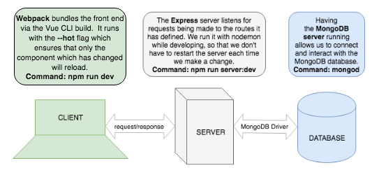

# Homework: Full Stack Games Hub App

### Learning Objectives

- Understand the relationship between client, server and database
- Be able to navigate a codebase that you haven't written

## Brief

Your boss has asked to you look over the codebase of a full-stack JavaScript application. The front-end is written in JavaScript using React, the back-end uses an Express server and a MongoDB database. Your task is to make yourself familiar with the codebase.

The application includes a README.md with instructions on running the application.

*Overview of the tech stack and tooling with commands*

*EDIT: Frontend is now written in React with the command to run `npm start`*

## MVP

### Task

Draw a diagram showing the dataflow through the application starting with a form submission, ending with the re-rendering of the page. This will involve a multi-direction data-flow with the client posting data to the server and the server sending data back to the client with the response. Detail the client, server and database in the diagram and include the names of the files involved in the process.

### Questions

1. What is responsible for defining the routes of the `games` resource?
a: helper function within server which defines all routes in the app

2. What do you notice about the folder structure?  Whats the client responsible for? Whats the server responsible for?
a: client holds all front-end functionality, determining the forms and information shown to the user as well as user interaction with the app.

server holds and determines routing between different urls as well as interaction between the front-end forms and database entries to allow full CRUD functionality

3. What are the the responsibilities of server.js?
a: it waits for requests by the client(front-end) and sends said requests to the routes defined within server.js(back-end) when running with nodemon there is no need to restart the server after each change, as hot-reloading is enabled with it.

4. What are the responsibilities of the `gamesRouter`?
a: gamesRouter responsiblities lie with routing form requests to the correct objects contained with GamesCollection

5. What process does the the client (front-end) use to communicate with the server?
a: client takes input from form, on form submit request is received by server, server sends response to client on successful request and applies changes/addition to database to the response

6. What optional second argument does the `fetch` method take? And what is it used for in this application? Hint: See [Using Fetch](https://developer.mozilla.org/en-US/docs/Web/API/Fetch_API/Using_Fetch) on the MDN docs
a: an init object which allows you to control a number of different settings

7. Which of the games API routes does the front-end application consume (i.e. make requests to)?
a:/api/games is the route it consumes

8. What are we using the [MongoDB Driver](http://mongodb.github.io/node-mongodb-native/) for?
a: We are using MongoDB driver to allow our Node.js application to interact with our MongoDB database using callbacks or promises

## Extension

Why do we need to use [`ObjectId`](https://mongodb.github.io/node-mongodb-native/api-bson-generated/objectid.html) from the MongoDB driver?

Add to your diagram the dataflow for removing a game.
